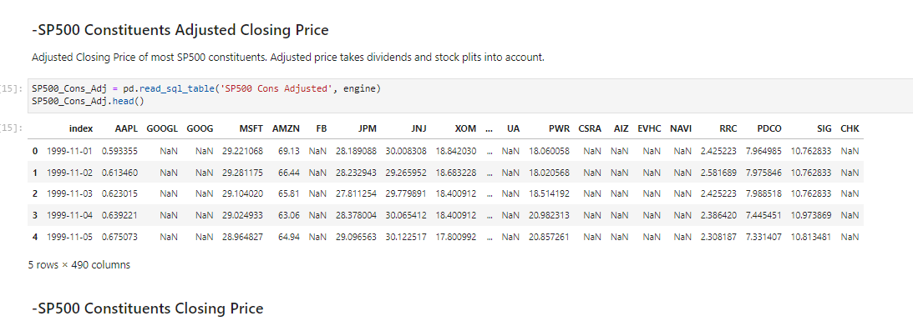
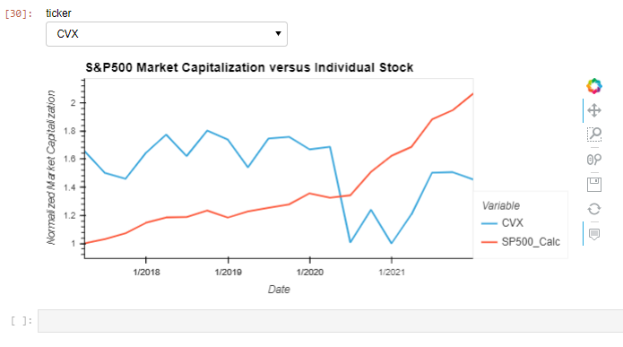
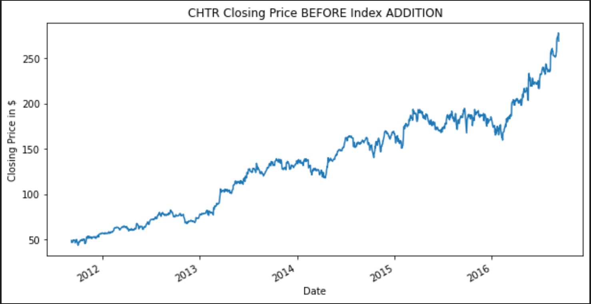
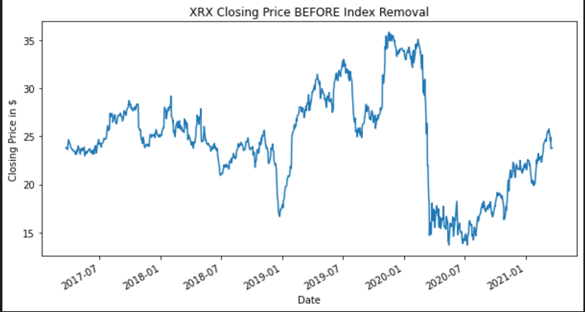

# Impact of Index Based Investing

This project aims to look at the impact that index based investing is having on the markets and individual stocks within the indexes.

An intersting article related to the work can be found here: https://www.theatlantic.com/ideas/archive/2021/04/the-autopilot-economy/618497/

## Introduction
There are two parts to this application. The first part is a series of Jupyter Notebooks that create tools designed to analyze the impact of index based investing on stocks within indexes, specifically the S&P 500.

https://www.theatlantic.com/ideas/archive/2021/04/the-autopilot-economy/618497/

The second application is a single Jupyter Notebook that is designed to visually analyze the cumulative returns of (2) different assets, specifically an ETF/Trust and either a stock or cryptocurrency. In this case, we will be analyzing crypto ETFs and Trusts and compere them to Bitcoin and Ethereum.

---

## Technologies

The following technology/software was used for this application:

APIs: Alphavantage and Yahoo Finance


-Python 3.7.11 (Programming language)

    Imported Python Libraries/Packages:
    
    -import pandas as pd
    -from pathlib import Path
    -import hvplot.pandas
    -from dotenv import load_dotenv
    -import requests
    -import json
    -import os
    -import time
    -from panel import interact
    -import yfinance as yf
    -from fileio import get_etf
    -from fileio import get_crypto
    -from fileio import plot_returns
    -from fileio import plot_investment
    
-JupyterLab

-Git version 2.34.11.windows.1

-Windows 10 Operating System

---

## Installation Guide

To install the Crypto_ETF_Analyzer application on your machine, download (or clone using http link) all files contained in this repository and run the application in a Jupyter Notebook with all noted modules installed above. PLEASE NOTE: The Yahoo Finance module is required to run this application. To install this module, run this command in your local terminal in dev environment.
```
$ pip install yfinance --upgrade --no-cache-dir
```
---

## Main Source Code
The first Jupyter Notebooks that can be used are summarized here:


The worksheet Labeled Index Data collects a lot of information from various sources and stores in in a local Database called SP500.db.  This should come populated and does not need to be run.  Much of it's code is commented out because it consists of 500+ API loops that download information for S&P 500 constituent stocks.  Some of the API calls require a premium subscription with Alphavantage, but that shouldnt be necessary with the Database already built.




The worksheet labeled AUMvsMARKETCAP provides a way to compare different S&P500 MArket Capitalizations versus the S&P 500.  The graph a thte bottom allows you to choose different stocks to display against the S&P500.  This can be used to find interesting movements of stocks that do not conform to the movements of the greater index.




The worksheet labeled IndividualStocksvsSP500 is a work in progress and curently looks at minor variations in MArket Capitalization and what (if any) impact they have on Market Capitalization.

## Crypto ETF Analyzer

This application is split into two parts. Defned functions are located in the fileio.py file as follows:
```
"""Functions desgined to load data from Yfinance module,
and analyze performance in comparison to underlying assets (BTC and ETH).
"""

import yfinance as yf

def get_etf(etf_ticker):
    """This function uses YFinance module uses Yahoo Finance API to
    recall historical data"""
    etf_ticker = yf.Ticker(etf_ticker)
    etf_df = etf_ticker.history(period="max")
    etf_df["etf_pct_change"] = etf_df.loc[:, "Close"].pct_change()
    etf_df["etf_cum_returns"] = (etf_df.loc[:, "etf_pct_change"]+1).cumprod()
    return etf_df


def get_crypto(crypto_ticker):
    crypto_ticker = yf.Ticker(crypto_ticker)
    crypto_df = crypto_ticker.history(period="max")
    crypto_df["crypto_pct_change"] = crypto_df.loc[:, "Close"].pct_change()
    crypto_df["crypto_cum_returns"] = (crypto_df.loc[:, "crypto_pct_change"]+1).cumprod()
    return crypto_df

        
def plot_returns(etf_df, crypto_df):
    etf_plot = (etf_df).hvplot(x="Date", y="etf_cum_returns", title="Cumulative Returns", ylabel="Return")
    crypto_plot = (crypto_df).hvplot.line(x="Date", y="crypto_cum_returns", title="Cumulative Returns for BTC", ylabel="Cumulative Returns")
    return_plot = etf_plot * crypto_plot
    return return_plot
    
def plot_investment(etf_df, crypto_df, investment):
    etf_plot = (etf_df*investment).hvplot(x="Date", y="etf_cum_returns", title="Cumulative Returns", ylabel="Return")
    crypto_plot = (crypto_df*investment).hvplot.line(x="Date", y="crypto_cum_returns", title="Cumulative Returns for BTC", ylabel="Cumulative Investment Returns")
    investment_plot = etf_plot * crypto_plot
    return investment_plot
```
We will import these functions:
```
from fileio import get_etf
from fileio import get_crypto
from fileio import plot_returns
from fileio import plot_investment
```
Next, the only cell block that requires user input is as follows, where a user can input the ETF, asset and investment amount they would like to analyze:
```
# Set ETF and Crypto ticker symbols and investment amount

# Set ETF or asset ticker symbol from Yahoo Finance
etf_ticker = "GBTC"

# Set cryptocurrency ticker symbol from Yahoo Finance
crypto_ticker = "BTC-USD"

# Set investment amount as integer. How much would you have invested in either Bitcoin in 2014, or Ethereum in 2017?
investment = 20000
```
The below generated plots are examples of GBTC ad BTC-USD comparison:


## Conclusion
The above plots show that investing in a crypto ETF/Trust does not generate nearly the same amount of return as investing in Bitcoin or Ethereum. However, the ETFs/Trusts are less volatile and present less downside in a bear market.

---

## Effects and Analysis of Stock Addition/Removal to the SP500
This section will dive into the trends and patterns observed before and after a stock is either added or removed from the SP500. 

Pre - Addition: There is a sharp increase seen within the 2 years prior to addition.
The amplitude of this upturn as well as other factors will be further looked into in following projects. 



Pre - Removal: There is a sharp decrease seen within the 2 years prior to addition.
The amplitude of this downturn as well as other factors will be further looked into in following projects. 



## Contributors

David Lee Ping

email: davidleeping@gmail.com

Phone: 570.269.5973

LinkedIn: https://www.linkedin.com/in/david-lee-ping/


Michael Canavan

email: canavm2@gmail.com

Phone: 518.744.0927

---
Dev Patel

email: dev8125@gmail.com

Phone: 818-237-0847

---
## License

MIT License

Copyright (c) [2022] [David Lee Ping, Dev Patel, Mike Canavan, Carter]

Permission is hereby granted, free of charge, to any person obtaining a copy
of this software and associated documentation files (the "Software"), to deal
in the Software without restriction, including without limitation the rights
to use, copy, modify, merge, publish, distribute, sublicense, and/or sell
copies of the Software, and to permit persons to whom the Software is
furnished to do so, subject to the following conditions:

The above copyright notice and this permission notice shall be included in all
copies or substantial portions of the Software.

THE SOFTWARE IS PROVIDED "AS IS", WITHOUT WARRANTY OF ANY KIND, EXPRESS OR
IMPLIED, INCLUDING BUT NOT LIMITED TO THE WARRANTIES OF MERCHANTABILITY,
FITNESS FOR A PARTICULAR PURPOSE AND NONINFRINGEMENT. IN NO EVENT SHALL THE
AUTHORS OR COPYRIGHT HOLDERS BE LIABLE FOR ANY CLAIM, DAMAGES OR OTHER
LIABILITY, WHETHER IN AN ACTION OF CONTRACT, TORT OR OTHERWISE, ARISING FROM,
OUT OF OR IN CONNECTION WITH THE SOFTWARE OR THE USE OR OTHER DEALINGS IN THE
SOFTWARE.

